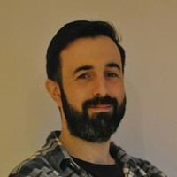
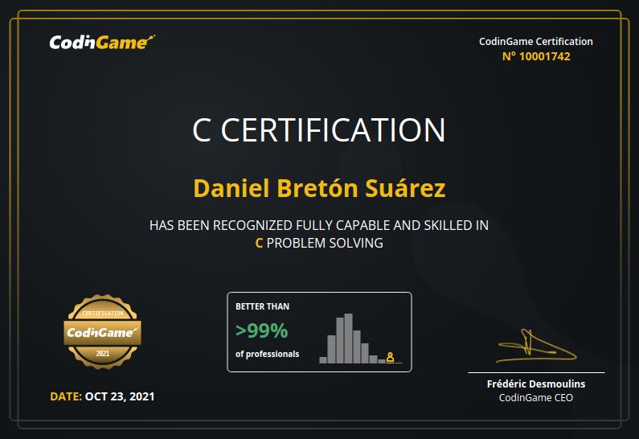
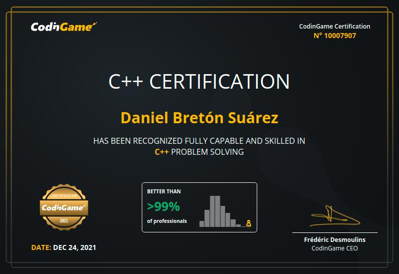

<meta name="viewport" content="width=device-width, initial-scale=1.0">

 Daniel Bretón Suárez
================================

<div align="right">
## Contact data

[d.breton.suarez@gmail.com](mailto:d.breton.suarez@gmail.com?subject=[Job opportunity])

[https://www.linkedin.com/in/dabresua/](https://www.linkedin.com/in/dabresua/)

</div>

<br>

----

>**Software engineer** with experience in IT and embedded.

----

**About me**: I am an experienced software engineer who provides solid problem-solving, independence, and innovative thinking.

I focus on developing highly optimized tools and applications. I'm passionate about writing outstanding unit tests. I also have experience on managing small teams and projects. I have experience developing multi-platform applications (Linux, Windows, MacOS) and embedded.

----

## Skills

### Programming Languages
| | | |
| :-- | :--: | ------: |
| C | **★★★★★** | Great experience in embedded developments |
| C++ | **★★★★★** | Experience in embedded and endpoint security. |
| Golang | **★★★★☆** | Experience in endpoint security |
| Python | **★★★★☆** | Experience in data collection automation and Kubernetes |
| Bash | **★★★★☆** | Experience in scripting, automation and endpoint security |
| Powershell | **★★★☆☆** | Experience in endpoint security |
| Assembly | **★★★☆☆** | Experience in embedded developments |
| Javascript | **★★☆☆☆** | No professional experience |
| Java | **★★☆☆☆** | No professional experience |

### Software Development

* Code quality, best practices, test driven development, debuggers
* Continuous integration and continuous development, Gitlab pipelines, Github actions
* Agile Development & Scrum

### Embedded Knowhow

* Architectures: 8-bit ARM, 32-bit ARM, 8-bit PIC, 8051, embedded Linux
* Low-level communications: SPI, UART, I2C
* MCU foundations: IRQs, low-power management, bus clocking, RTC
* RF: RFID, NB-IoT, 4G, 3G, 2G, LoRa, 868Mhz/433Mhz p2p radios
* Hardware design: Analysis, simulations, Schematics, PCB design
* Laboratory equipment: Soldering, multimeter, Oscilloscope, signal debugging

### IT Experience

* Cloud: AWS
* Virtualization & containers: Vagrant, Virtual Box, Docker, Kubernetes
* Automatization: Ansible, Bash, Powershell
* Multi-OS application: Linux (Debian, Ubuntu, Red Hat, CentOS, Amazon), Windows, MacOS

<div style="page-break-after: always"></div>

## Professional Experience

### [**Devo**](https://www.devo.com/)

```
Position     = Senior software engineer
Location     = Remote
Period       = From March 2022
Sector       = IT -> Cybersecurity
Description  = Develop and provide engineering support for a multi-platform and multi-purpose
               endpoint monitoring solution based on Osquery to recollect a variety of datasets
               sitting in their infrastructure, efficiently process them, and create a
               comprehensive view that spans multiple applications and use cases in areas such as
               security monitoring, IT health, and performance monitoring or capacity planning.
               Provide visibility and collaborate with the Osquery open-source project.
Technologies = C++, Golang, AWS, Vagrant, Ansible, Docker
```

### [**ZIV Automation**](https://www.zivautomation.com/)

```
Position     = Embedded software engineer
Location     = Bilbao Area
Period       = From September 2018 to March 2022
Sector       = Industrial -> Smart Grids
Description  = Develop embedded software for multiple smart grid projects.
               Develop drivers for ARM 32-bit MCU. Develop tools and scripts.
               Manage software teams. Implement good practices.
               Schedule software projects. Design architecture.
               Technology consultant. International project on Saudi Arabia.
Technologies = C, C++, Python, Assembly
```
### [**Treelogic**](https://www.treelogic.com/en/)

```
Position     = Hardware and Firmware engineer
Location     = Central Asturias Area
Period       = From April 2015 to September 2018
Sector       = R&D -> IT/Robotics
Description  = Develop hardware and embedded software for multiple projects.
               Schedule projects. Design architecture.
               Technology consultant and forecasting.
Technologies = C, Assembly, PCB design
```

### [**Capgemini**](https://www.capgemini.com/?georedirect_none=true)

```
Position     = Software engineer
Location     = Central Asturias Area
Period       = From October 2014 to April 2015
Sector       = IT -> Consultancy
Description  = Develop software for insurance company.
Technologies = Java, C++
```

### [**Ikerlan**](https://www.ikerlan.es/en/)

```
Position     = Power electronics researcher
Location     = Remote
Period       = From September 2013 to October 2014
Sector       = Industrial -> R&D
Description  = Research new technology for DC-DC converters (equalizer).
Technologies = Power electronics
```

<div style="page-break-after: always"></div>

## Education
### University
**Master of Science** in **telecommunications engineering** conducted at [Universidad de Oviedo](https://www.uniovi.es/en/inicio). Asturias, Spain.

* Strong focus on calculus and algebra. Including mathematical modeling and simulations.
* Electronic theory, simulations and prototyping for power electronics, control and communications.
* Software engineering foundations. OOP and embedded devices. Computational complexity, algorithms, computer science and network architecture.
* Signal theory and stochastic processes for telecommunications systems modeling.
* Strong focus on electromagnetism theory. Antenna prototyping.
* Project management, feasibility and viability analysis.
* Technical drawing and CAD basics.
* Classical physics and quantum theory basics.
* Basics on economics.

### Post-graduate Education
| Subject | Company | Year | Description |
| ------- | ------- | ---- | ----------------- |
| Bootstrap 5 tutorial | w3schools | 2023 | Bootstrap 5 HTML, CSS, and JavaScript framework |
| Javascript tutorial | w3schools | 2023 | Javascript programming language |
| CSS tutorial | w3schools | 2023 | CSS stylesheet language |
| HTML tutorial | w3schools | 2023 | HTML language |
| Kubernetes for the Absolute Beginners | Mumshad Mannambeth | 2023 | Kubernetes Fundamentals, clusters and applications |
| Ansible for the Absolute Beginners | Mumshad Mannambeth | 2023 | Ansible Fundamentals, deployments, inventory files |
| Unit test for Go developers | Vinicius Silva | 2023 | Test driven development in Golang, unit tests and libraries |
| TDD in C++ | Serban Stoenescu | 2023 | Test Driven Development in C++ with Googletest and Googlemock |
| The Agile Samurai Bootcamp | Jonathan Rasmusson | 2023 | Setup, execute, and successfully deliver Agile projects |
| AWS Essentials | Amazon Web Services (AWS) | 2023 | AWS Platform, global infrastructure, security, and the core services |
| Essential productivity skills | LifeLabs Learning | 2022 | Habits to increase daily productivity |
| Go: The Complete Developer's Guide | Stephen Grider | 2022 | Master the fundamentals and advanced features of the Go Programming Language (Golang) |
| Ansible for beginers | Mumshad Mannambeth | 2022 | Ansible to beginner in DevOps. Practice Ansible with coding exercises |
| Code quality on Python | Toronto University | 2021 | Writing quality code that runs correctly and efficiently |
| Remote team management | GitLab | 2021 | Learn and apply remote work best practices, build your remote work policy |
| Gitlab best practices | ZIV | 2021 | How to work efficiently using Gitlab |
| Doxygen best practices | ZIV | 2021 | Best ways to document C/C++ code using doxygen |
| Unitary tests and continuous integration | ZIV | 2020 | Implement continuous integration using Jenkins |
| Static code analysis tools | ZIV | 2020 | Tools for analyzing C/C++ code quality |
| GNU Autotools | ZIV | 2019 | In-deep GNU Build System (Autotools) workshop for building software under Linux systems |
| Introduction to PRIME | ZIV | 2019 | Prime protocol basics for communicating using the electricity network |
| Code style | Tecnalia | 2019 | Best practices to code efficiently in C/C++ |
| Electrical risks and security | Tecnalia | 2019 | Guidelines to working safe in a environment with electrical risks |

<div style="page-break-after: always"></div>

## Awards
### 2015 Third Prize Paper Award.

The Transportation Systems Committee of the IEEE Industry Applications Society.

For the manuscript co-authored with M. Arias, M.M. Hernando, U. Viscarret and Iñigo Gil, entitled "Equalization system for serially-connected battery cells based on the wave-trap concept" as presented at the 2014 Energy conversion Congress and Exposition, Pittsburgh, PA, USA.

### Codingame

| | |
| ----- | ----- |
| [**C language certification**](https://www.codingame.com/certification/eSfDFqIQU9tl14dGjPRGAg) | [**C++ language certification**](https://www.codingame.com/certification/1BuYfr1KIcPI7FwwGa0H7g) |
| {width=75%} | {width=75%} |


## Interests

Apart from being a software engineer, I am the father of a baby which takes most of my time. When he sleeps I work on home projects.

I like to have an active lifestyle, in winter I'd like to go swimming while in summer hiking is my passion. I looking forward to my baby growing strong to hike with me.

I also like going to live music concerts, enjoying the great gastronomy of nortern Spain, and sometimes I homebrew beer.

## Other links of Interest

| | |
| :---- | ----: |
| [](https://www.linkedin.com/in/dabresua/) | [https://www.linkedin.com/in/dabresua/](https://www.linkedin.com/in/dabresua/) |
| [](https://dbsportfolio.wordpress.com/) | [https://dbsportfolio.wordpress.com/](https://dbsportfolio.wordpress.com/) |
| [](https://bit.ly/3xL5Evp) | [https://bit.ly/3xL5Evp](https://bit.ly/3xL5Evp) |
| [](https://github.com/dabresua) | [https://github.com/dabresua](https://github.com/dabresua) |
| [](https://www.codewars.com/users/dabresua) | [https://www.codewars.com/users/dabresua](https://www.codewars.com/users/dabresua) |
| [](https://www.hackerrank.com/d_breton_suarez) | [https://www.hackerrank.com/d_breton_suarez](https://www.hackerrank.com/d_breton_suarez) |

<br>

---

Last modification: 06/12/2023

This document is public and is hosted at: [https://dabresua.github.io/curriculum_vitae](https://dabresua.github.io/curriculum_vitae)

This document has been generated using markdown and pandoc, source code is open and available at [https://github.com/dabresua/curriculum_vitae](https://github.com/dabresua/curriculum_vitae)
